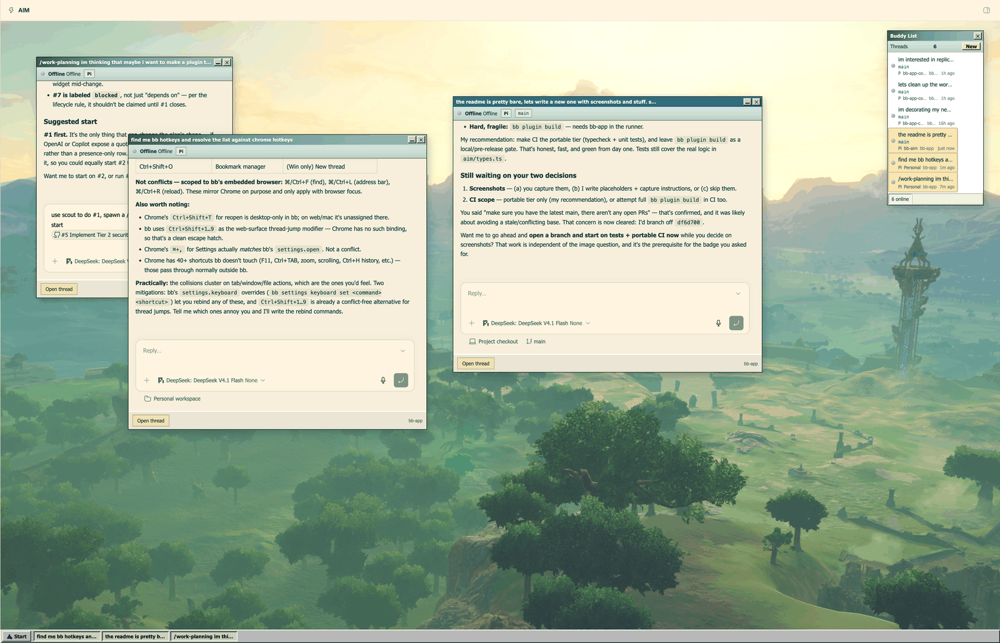

# bb-aim

[](https://github.com/RCopeland/bb-aim/actions/workflows/ci.yml)
[](LICENSE)

An AOL Instant Messenger-style desktop for [bb-app](https://github.com/get-bb/bb):
a **buddy list** of your threads and floating **instant-message windows**, all
rendered inside the app.

Your threads become buddies. Clicking one opens an IM window with the real
chat. When a thread needs you and its window is hidden, the window pops back in.



## What you get

- **A buddy list of your threads** — bb's own parent/child thread tree, drawn as
  deliberately minimal AIM-style rows: a presence dot and the thread title.
  Pinned threads carry a gold star, a "needs you" badge marks threads waiting on
  you, and the one row action is archive, through bb's own thread APIs. The
  detail the old dense rows showed (presence state, unread, running work,
  branch, machine, project, provider and last activity) still reaches assistive
  tech through each row's accessible name, and opening a thread shows the real
  detail in its IM window.
- **IM windows with the real chat** — each window wraps bb's own `ThreadChat`
  component, so you get the actual timeline (tool calls, diffs, file rows,
  queued messages), the real composer, attachments, @-mentions, drafts, and the
  thread's own permission mode. Sends go through the host submit pipeline, so
  they behave exactly as they do in the main pane.
- **Pops back when you're needed** — when a thread starts needing you and its
  window is hidden, the window returns with a short emphasis animation. Fires on
  the rising edge only, so it never re-pops every render.
- **A taskbar** — one button per IM window, visible or hidden. Recalled from
  there without opening the buddy list, and a thread that needs you is flagged
  in place.
- **Closing hides, never kills** — a hidden window keeps its thread, position,
  and state. The thread keeps running in bb-app.
- **A wallpaper you choose** — right-click the desktop to upload a
  PNG/JPEG/GIF/WebP image. Stored server-side, so it survives reloads and app
  restarts. "Restore default" brings back the built-in backdrop.
- **Accessible by default** — rows and window controls are real `<button>`s with
  labels, and the emphasis animation and presence pulse respect
  `prefers-reduced-motion`.

## Install

```sh
bb plugin install git:https://github.com/RCopeland/bb-aim --subdirectory bb-plugin-aim
bb plugin reload aim
```

The `--subdirectory` flag is required: the plugin lives in `bb-plugin-aim/`, and
the repository root is not itself a plugin (there is no `.bb/plugins.json`).

From a local checkout:

```sh
git clone https://github.com/RCopeland/bb-aim
cd bb-aim/bb-plugin-aim
npm install
bb plugin install .
bb plugin reload aim
```

Requires bb `>=0.42` and plugin SDK `>=0.4.47`. Once installed, the **AIM** entry
appears in the sidebar.

## Development

```sh
cd bb-plugin-aim
npm ci
npm run typecheck   # plugin sources + tests
npm test            # unit and integration tests
npm run build       # bb plugin build — the plugin-contract gate
bb plugin dev .     # watch, rebuild, and reload on change
```

Contributions go through pull requests against `main`. CI runs typechecking,
the test suite, and a build that reproduces bb's managed git install, so a
plugin that only builds with devDependencies present fails before merge.

### Testing

Two layers, 82 tests:

- **Pure logic** (`test/types.test.ts`) — the presence and attention mapping plus
  the row-format helpers in `aim/types.ts`. No plugin host needed.
- **Server behaviour** (`test/server.test.ts`) — `server.ts` driven through the
  official `@get-bb/plugin-sdk/testing` fake host: real RPC dispatch with
  contract validation, a real SQLite database, and a real Hono context for the
  wallpaper HTTP route. Covers the wallpaper lifecycle, the size cap, and the
  rule that uploads are typed by their **magic bytes**, never by the caller's
  claimed MIME type.

## How it works

The desktop is a single `navPanel` route with its own sidebar entry — the one
and only AIM surface. The buddy list is a **parallel view, not a sidebar
replacement**: bb's default sidebar list stays registered and untouched, and the
buddy list reads the same host hooks bb's own rows read but presents a
deliberately minimal, AIM-style row rather than copying the default sidebar's
dense detail.

The only server-side piece is wallpaper persistence — the image is stored as a
BLOB in the plugin's SQLite database and served back through a plugin HTTP
route. There are deliberately **no thread read/write RPCs**: the IM windows
render the host's own chat, so the plugin never reimplements thread transcripts
or sends.

Full design notes, including why the vendored 98.css theme and the hand-rolled
chat path were removed, are in
[bb-plugin-aim/README.md](bb-plugin-aim/README.md).

## Layout

```
bb-plugin-aim/
  app.tsx                 registers the navPanel (sidebar entry + desktop route)
  server.ts               wallpaper: SQLite BLOB, HTTP route, RPC contract
  aim/
    DesktopPage.tsx       desktop page: wallpaper, context menu, windows, taskbar
    BuddyList.tsx         the buddy list (one BuddyRow per thread)
    MessageWindow.tsx     the IM window: AIM chrome around the host ThreadChat
    types.ts              indicator -> presence/attention mapping + row helpers
    useAimDrag.ts         pointer-based drag
    useAimResize.ts       pointer-based corner resize
    chrome.css            window chrome primitives, scoped under .aim-xp
  aim.css                 the AIM palette, desktop layout, wallpaper, menus
  test/                   unit + fake-host integration tests
```

## License

[MIT](LICENSE) © Rob Copeland
